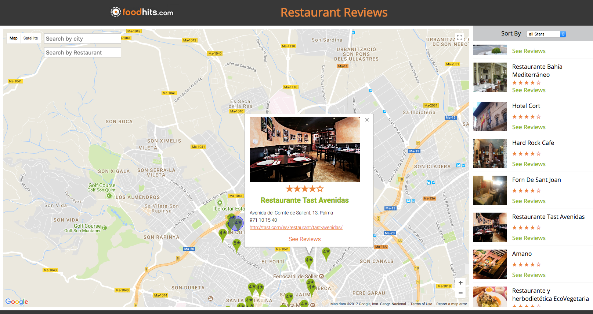

# Launch your own restaurant review site
## FrontEnd Web Developer Project 7
### JavaScript, Google maps API, Google Places API, HTML5, CSS3


* A Google Maps map loaded with the Google Maps API
* The Google Maps map will focus immediately on the position of the user.
* A list of restaurants is provided as JSON data in a separate file
* A list of restaurants on the right side of the page that are within the area displayed on the map
* When you click on a restaurant, the list of reviews should be shown
* Also show the Google Street View photo via the corresponding API! 
* A filter tool allows the display of restaurants that have between X and Y stars
* Add a restaurant by clicking on a specific place on the map
* Use the Google search API to find restaurants in a particular display area.

#### By Debbie O'Brien
25 September 2017


### View the applicatiion here
https://debs-obrien.github.io/restaurant-reviews-OpenClassRooms-project-7



### Example Code
```javascript
/*-----------------------------------------------------------------------------------
Builds the small info Window
-------------------------------------------------------------------------------------*/
function buildIWContentSmall(place) {
   document.getElementById('iw-icon-small').innerHTML = '';
   document.getElementById('iw-url-small').innerHTML = '<b>' + place.name + '</b>';
   if (place.rating) {
       let ratingHtml = '';
       for (let i = 0; i < 5; i++) {
          if (place.rating < (i + 0.5)) {
              ratingHtml += '&#10025;';
          } else {
              ratingHtml += '&#10029;';
          }
          document.getElementById('iw-rating-small').style.display = '';
          document.getElementById('iw-rating-small').innerHTML = ratingHtml;
       }
   } else {
       document.getElementById('iw-rating-small').style.display = 'none';
   }
}
```